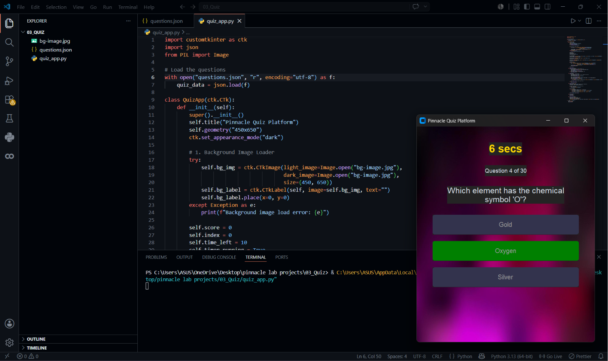

# 🧠 Online Quiz Platform

An interactive Quiz Application built using Python and CustomTkinter featuring timed questions, answer validation, score tracking, and a modern user interface.

## ✨ Features

- ⏳ 10-second countdown timer for each question
- 🎯 Multiple-choice questions
- ✅ Instant correct answer highlighting
- ❌ Wrong answer feedback
- 📊 Automatic score calculation
- 📈 Percentage-based performance evaluation
- 🔄 Play Again functionality
- 🎨 Custom background image support
- 🌙 Modern dark-themed GUI
- 📂 Questions loaded dynamically from a JSON file

## 🛠️ Technologies Used

### Python
The core programming language used to build the application.

### CustomTkinter
Used to create a modern and visually appealing graphical user interface.

### JSON
Stores quiz questions and answers separately from the application logic.

### Pillow (PIL)
Used for loading and displaying the custom background image.

## 📸 Application Preview



## 📂 Project Structure

```text
Online-Quiz-Platform/
│
├── screenshots/
│   └── image_preview.png
│
├── bg-image.jpg
├── questions.json
├── quiz_app.py
├── requirements.txt
└── README.md
```

## 🚀 How to Run

### 1. Clone the Repository

```bash
git clone https://github.com/your-username/Online-Quiz-Platform.git
```

### 2. Install Dependencies

```bash
pip install -r requirements.txt
```

### 3. Run the Application

```bash
python quiz_app.py
```

## 🎯 Quiz Features

- Timer-based questions
- Real-time answer validation
- Score tracking
- Performance analysis
- Interactive user experience
- Responsive GUI design

## 📚 Learning Outcomes

This project helped in understanding:

- GUI Development with CustomTkinter
- JSON Data Handling
- Event-Driven Programming
- Timer Implementation
- User Interaction Design
- Python Application Development

## 👩‍💻 Author

**Ankita Nayak**

Project developed as part of the Python Development Internship at Pinnacle Labs.